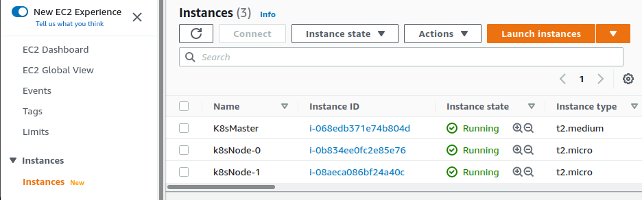

# Creating Kubernetes Cluster using Terraform

I recently racked up a $72 USD bill while using AWS Cloud Free Tier creating a K8s cluster with Jenkins, Nexus, SonarQube (I will use IaC to recreate this :-).

I understand that there will be usage of services that will generate costs from time to time. However, I didn't expected this much. 

I took the time out to create a Kubernetes cluster using terraform for the infrastructure (1 Manager and 2 Worker Nodes) and shell scripting to create the user data files (manager.sh and worker.sh)

The Manager Node is a t2.medium (NOT Free Tier Eligible)

The Worker nodes though are t2.micro (free tier Eligible)

## Run Terraform code to create the infrastructure

* initialize the tf script
> `terraform init`

* Create the exceution plan.
* It allows us to see the changes that will be made to the infrastructure
> `terraform plan`

* Apply the config 
* we can use -auto-approve to auto confirm the yes step (though not recommended)
> `terraform apply`

### When finished, all that is left to do is to tear down the work area WHEN WORK COMPLETED

* we can use -auto-approve as well to auto confirm the yes step
> `terraform destroy`

All that is needed now is to create the token on the Manager and copy and run on the Workers

`sudo kubeadm token create --print-join-command`

### Verify on the Worker Nodes
`kubectl get nodes`

`kubectl get pods`

## Screenshot of the result

